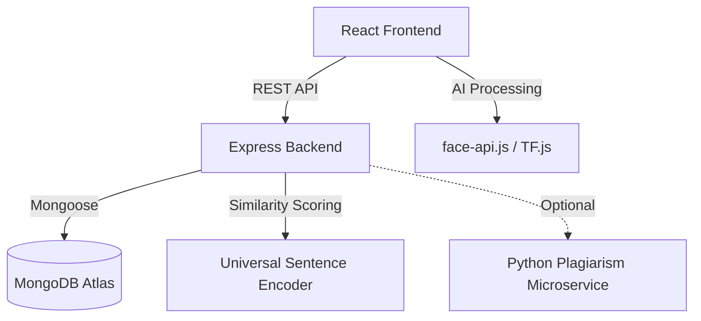

# 🧠 AI-Based Cognitive Monitoring Platform


A state-of-the-art, AI-powered online examination proctoring and cognitive analytics platform. This system leverages multi-modal AI to monitor student behavior, assess cognitive load, and ensure academic integrity in real-time.

---

## 🚀 Live Demo

| Component | Status | URL |
| :--- | :--- | :--- |
| **Examination Portal** | 🟢 Live | [Click Here](https://ai-cognitive-ai-cognitive-monitorin.vercel.app) |
| **Backend API** | 🟢 Live | [Click Here](https://ai-cognitive-monitoring-backend.vercel.app) |

---

## ✨ Key Features

### 🎥 Multi-Modal AI Proctoring
- **Face Biometrics**: Real-time face detection and recognition using `face-api.js` (TensorFlow.js).
- **Behavioral Analysis**: Detects presence, Eye Aspect Ratio (EAR) for fatigue, and head pose for distraction.
- **Acoustic Monitoring**: Real-time voice frequency and amplitude analysis to detect acoustic anomalies.
- **Kinetic Dynamics**: Analyzes inter-keystroke intervals to measure typing anxiety and cognitive stress.

### 🤖 Intelligent Grading & Integrity
- **NLP Grading**: Uses TensorFlow's **Universal Sentence Encoder** for semantic similarity scoring of descriptive answers.
- **Plagiarism Detection**: High-accuracy comparison against reference answers and peer submissions.
- **Integrity Score Engine**: A weighted scoring system that tracks tab switches, copy-pasting, and biometric anomalies.

### 📊 Advanced Analytics
- **Cognitive HUD**: Real-time visual dashboard for students showing their cognitive load.
- **Performance Radar**: Multi-dimensional analysis of accuracy, productivity, and stress levels.
- **Admin Dashboard**: Comprehensive overview of all exam sessions with risk-level flags.

---

## 🏗️ Technical Architecture



---

## 🛠️ Technology Stack

| Layer | Technologies |
| :--- | :--- |
| **Frontend** | React 19, Recharts, React Router v7 |
| **Backend** | Node.js, Express 5, Axios |
| **AI/ML** | TensorFlow.js, face-api.js, USE |
| **Database** | MongoDB Atlas, Mongoose |
| **Deployment** | Vercel (Frontend & Serverless Functions) |

---

## 🚦 Local Setup

### Prerequisites
- Node.js 18+
- MongoDB (Local or Atlas)

### 1. Clone & Install
```bash
git clone https://github.com/BharatSinghParmar/ai-cognitive-monitoring.git
cd ai-cognitive-monitoring
```

### 2. Configure Backend
```bash
cd backend
cp .env.example .env
# Update .env with your MONGO_URI
npm install
npm start
```

### 3. Configure Frontend
```bash
cd Frontend
cp .env.example .env.local
# Set REACT_APP_API_URL=http://localhost:5001
npm install
npm start
```

---

## 📂 Repository Structure

- `Frontend/`: The React-based examination portal.
- `backend/`: The Node.js Express API and AI processing logic.
- `scripts/`: Utility scripts for database diagnostics and testing.
- `PROJECT_DOCUMENTATION.html`: Deep-dive technical documentation.

---

## 📜 License

Distributed under the MIT License. See `LICENSE` for more information.

---

**Developed with ❤️ by Bharat Singh Parmar and team :
Kratika Soni B.Tech(CSE)                              	A20405222206
Bharat Singh Parmar B.Tech(CSE)                	A20405222117
Devprakash Singh Rawat B.Tech(CSE)         	A20405222006
Vishal Jangir B.Tech(CSE)                               	A20405222219
Lakshay Jangid B.Tech(CSE)                         	A20405222124
**
